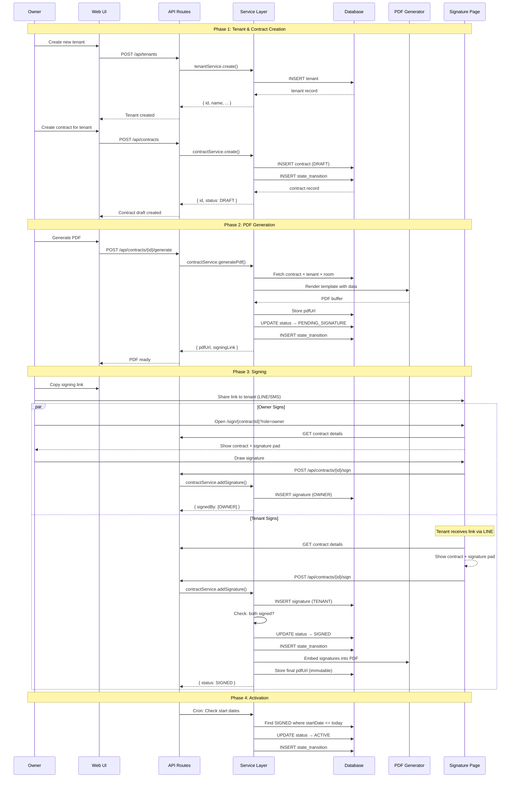

# Contract Automation System Design

## 1. Contract Lifecycle Flow

```
┌─────────────────────────────────────────────────────────────────────────────┐
│                           CONTRACT LIFECYCLE                                 │
└─────────────────────────────────────────────────────────────────────────────┘

  [Tenant Created]
        │
        ▼
  ┌─────────────┐      Template + Data      ┌─────────────┐
  │   DRAFT     │ ─────────────────────────▶│  Generate   │
  │             │                           │    PDF      │
  └─────────────┘                           └──────┬──────┘
        │                                          │
        │  Owner Reviews                           │
        ▼                                          ▼
  ┌─────────────┐      Create Signing Link   ┌─────────────┐
  │  PENDING_   │ ◀─────────────────────────│  PDF Ready  │
  │  SIGNATURE  │                           │   + Stored  │
  └─────────────┘                           └─────────────┘
        │
        ├───────────────────┬───────────────────┐
        ▼                   ▼                   ▼
  ┌───────────┐       ┌───────────┐       ┌───────────┐
  │  In-Person│       │  Mobile   │       │  Shared   │
  │  (Tablet) │       │  Browser  │       │   Link    │
  └─────┬─────┘       └─────┬─────┘       └─────┬─────┘
        │                   │                   │
        └───────────────────┴───────────────────┘
                            │
                      Touch Signature
                            │
                            ▼
  ┌─────────────┐     Both Parties      ┌─────────────┐
  │   SIGNED    │ ◀──── Signed? ────────│ Waiting for │
  │             │         Yes           │ 2nd Signer  │
  └─────────────┘                       └─────────────┘
        │
        │  Start Date Reached
        ▼
  ┌─────────────┐
  │   ACTIVE    │ ◀─────────────────┐
  │             │                   │
  └─────────────┘                   │
        │                           │
        │  30 Days Before End       │ Renewal
        ▼                           │
  ┌─────────────┐      New Contract │
  │  EXPIRING   │ ──────────────────┘
  │             │
  └─────────────┘
        │
        ├─────────────┐
        ▼             ▼
  ┌───────────┐  ┌────────────┐
  │  RENEWED  │  │ TERMINATED │
  └───────────┘  └────────────┘
```

---

## 2. Recommended Libraries

### PDF Generation

| Library | Pros | Cons | Recommendation |
|---------|------|------|----------------|
| **[@react-pdf/renderer](https://react-pdf.org/)** | React components, Thai fonts, full control | More complex setup | ✅ **Best for templates** |
| [puppeteer](https://pptr.dev/) | HTML→PDF, CSS support | Heavy, requires Chrome | Good for complex layouts |
| [jsPDF](https://github.com/parallax/jsPDF) | Lightweight, client-side | Limited Thai support | Not recommended |
| [pdf-lib](https://pdf-lib.js.org/) | Edit existing PDFs | Can't render HTML | For post-processing |

**Chosen Stack**:
```
@react-pdf/renderer     # Template rendering
+ pdf-lib               # Add signatures to PDF
+ sharp                 # Image processing for signatures
```

### Digital Signature

| Library | Purpose |
|---------|---------|
| **[signature_pad](https://github.com/szimek/signature_pad)** | Touch/mouse signature canvas |
| **[react-signature-canvas](https://github.com/agilgur5/react-signature-canvas)** | React wrapper for signature_pad |

**Chosen**: `react-signature-canvas` (simple, mobile-friendly, outputs base64)

### Template Engine

| Approach | Description |
|----------|-------------|
| **Markdown + mustache** | Simple variable substitution |
| **React components** | Full control with @react-pdf |

**Chosen**: React components with props (type-safe, reusable)

---

## 3. Data Flow: Tenant Creation → Signed Contract



---

## 4. Signing Link Flow

### URL Structure
```
https://your-domain.com/sign/{contractId}?token={signToken}&role={owner|tenant}
```

### Token Generation
```typescript
// Generate secure signing token (expires in 7 days)
const signToken = jwt.sign(
  { contractId, role, exp: Date.now() + 7 * 24 * 60 * 60 * 1000 },
  process.env.SIGNING_SECRET
);
```

### Mobile Signature Page
```
┌─────────────────────────────────┐
│  สัญญาเช่าห้อง 101              │  Contract title
├─────────────────────────────────┤
│                                 │
│  [PDF Preview / Key Terms]      │  Scrollable
│                                 │
├─────────────────────────────────┤
│  ┌───────────────────────────┐  │
│  │                           │  │
│  │    ✏️ Sign Here           │  │  Signature pad
│  │                           │  │
│  └───────────────────────────┘  │
├─────────────────────────────────┤
│  ☑ ข้าพเจ้ายอมรับเงื่อนไข        │  Consent checkbox
├─────────────────────────────────┤
│  [        ลงนาม        ]        │  Submit button
└─────────────────────────────────┘
```

---

## 5. Immutable Storage

### Strategy
1. **Draft PDFs**: Stored in `/contracts/drafts/{id}.pdf`
2. **Signed PDFs**: Stored in `/contracts/signed/{id}_v{version}.pdf`
3. **Never overwrite**: New versions get new paths
4. **Hash verification**: Store SHA-256 hash with contract record

```typescript
// On final signature
const finalPdf = await embedSignatures(draftPdf, signatures);
const hash = crypto.createHash('sha256').update(finalPdf).digest('hex');

await db.contract.update({
  where: { id },
  data: {
    pdfUrl: `/contracts/signed/${id}_v${version}.pdf`,
    pdfHash: hash,
    status: 'SIGNED'
  }
});
```

---

## 6. Key Files to Implement

```
integrations/pdf/
├── generator.ts          # React-PDF template rendering
├── embedder.ts           # Add signatures to final PDF
└── templates/
    └── rental-contract.tsx  # React-PDF component

app/sign/
└── [contractId]/
    └── page.tsx          # Public signature capture page

app/api/contracts/
├── route.ts              # CRUD operations
└── [id]/
    ├── generate/route.ts # PDF generation
    └── sign/route.ts     # Signature submission
```
